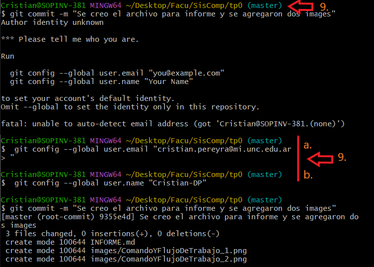
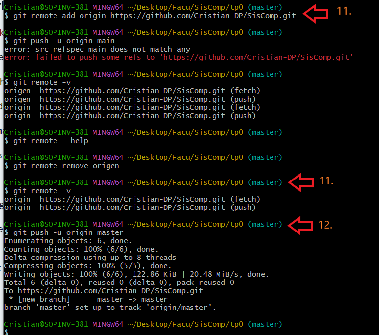
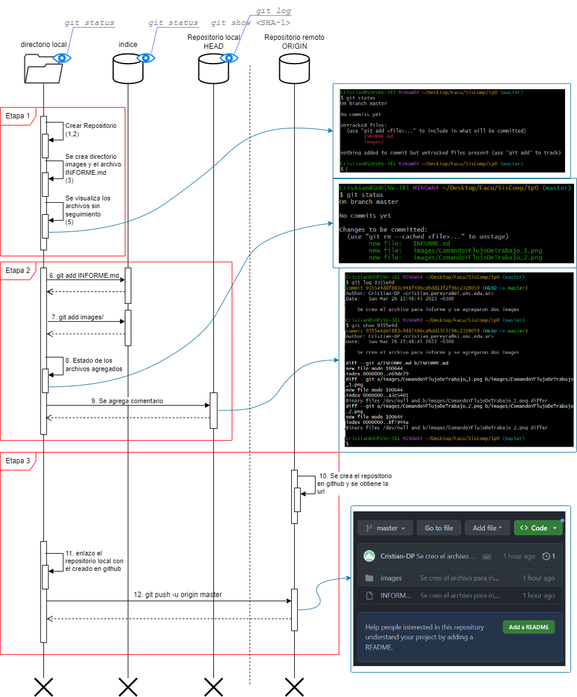

# TP0 - Uso de GitHub

| Version  | Fecha   | Descripción     |
| -------- | ------- | --------------- |
| 1.0      | 27-03   | Primera version |

- Estudiante
  - Cristian Pereyra
- Carrera
  - IComp
- Materia
  - Sistemas de computación
- Profesor
  - Ing. Javier Jorge
  - Mgr. Ing. Miguel Solinas

## Indice
- Enunciado
- Desarrollo
  - Primera parte
  - Segunda parte
  - Tercera parte

## Enunciado
conocer herramientas de consola básicas

## Desarrollo

### Primera parte

1. Se crea branch de nombre "rama"
2. Nos movemos al branch "rama"
3. Editamos INFORME.ms
4. Agregamos el informe al arbol de indice
5. Agreamos el informe al arbol HEAD local con comentario
6. Editamos la imagen
7. subimos los cambios

### Segunda parte

8. Se Edita INFORME.md desde local
9. Agregamos el informe al arbol de indice
10. Agreamos el informe al arbol HEAD local con comentario
11. Editamos la imagen
12. subimos los cambios

### Tercera parte

10.  Se crea repositorio en github y se obtiene la url
11.  Se elaza el reporitorio local con la url del punto 10.
12.  se pushean los archivos
13.  se visuliza en github  

## Diagrama de secuencia

