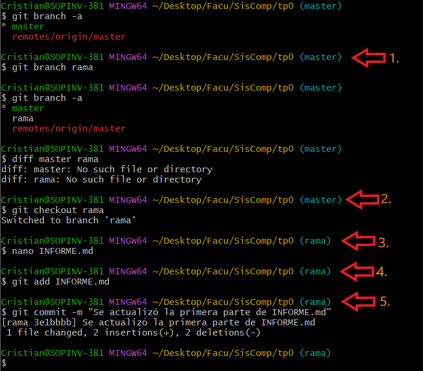
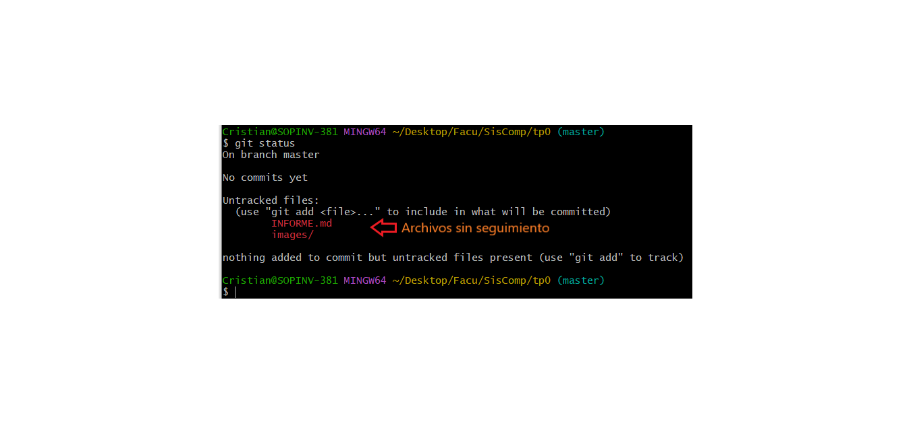

# TP0 - Uso de GitHub

| Version  | Fecha   | Descripción     |
| -------- | ------- | --------------- |
| 1.0      | 27-03   | Primera version |

- Estudiante
  - Cristian Pereyra
- Carrera
  - IComp
- Materia
  - Sistemas de computación
- Profesor
  - Ing. Javier Jorge
  - Mgr. Ing. Miguel Solinas

## Indice
- Enunciado
- Desarrollo
  - Primera parte
  - Segunda parte
  - Tercera parte

## Enunciado
conocer herramientas de consola básicas

## Desarrollo

### Primera parte

1. Se crea branch de nombre "rama"
2. Nos movemos al branch "rama"
3. Editamos INFORME.ms
4. Agregamos el informe al arbol de indice
5. Agreamos el informe al arbol HEAD local con comentario
6. Editamos la imagen
7. subimos los cambios

### Segunda parte

8. Se Edita INFORME.md desde local
9. Se edita INFORME.md desde github y se pushea
10. Se pushea los cambios locales
11. Se resuelve el conflicto
12. Se pushea a github la resolución

