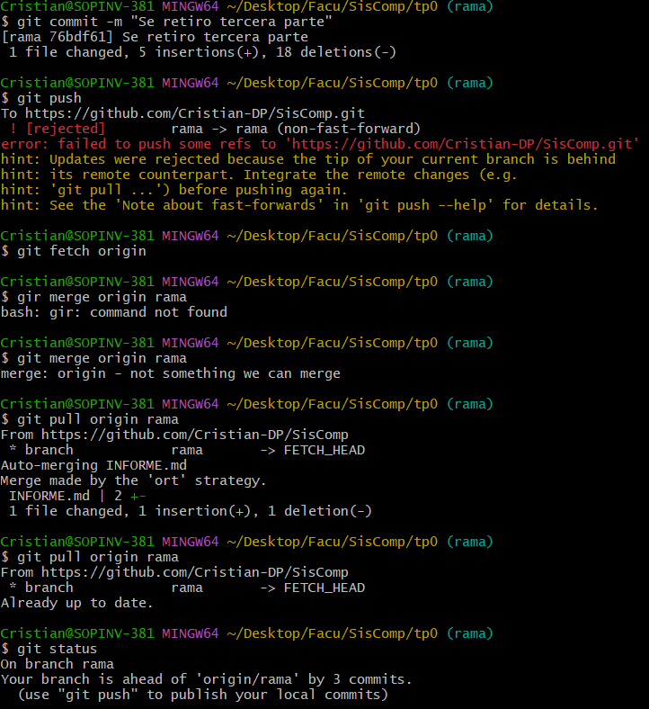

# TP0 - Uso de GitHub

| Version  | Fecha   | Descripción     |
| -------- | ------- | --------------- |
| 1.0      | 27-03   | Primera version |

- Estudiante
  - Cristian Pereyra
- Carrera
  - IComp
- Materia
  - Sistemas de computación
- Profesor
  - Ing. Javier Jorge
  - Mgr. Ing. Miguel Solinas

## Indice
- Enunciado
- Desarrollo
  - Primera parte
  - Segunda parte
  - Tercera parte

## Enunciado
conocer herramientas de consola básicas

## Desarrollo

### Primera parte

1. Se crea el repositorio de manera local
2. Se crea el repositorio de manera local
3. Se crea directorio y archivo
4. Se visualiza lo creado en el punto 4.

### Segunda parte

6. Se agrega INFORME.md al arbol indice
7. Se agrega images/ al arbol indice
8. Se revisa el estado de los archivos
9. Se agrega comentario

### Tercera parte

10.  Se crea repositorio en github y se obtiene la url
11.  Se elaza el reporitorio local con la url del punto 10.
12.  se pushean los archivos
13.  se visuliza en github  

## Diagrama de secuencia

